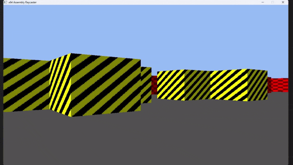

# x64Raycast
Raycasting renderer made fully in x86 Assembly without the standard library on x64 Windows.

It's a partial implementation of [Lode Vandevenne's Raycasting Tutorial](https://lodev.org/cgtutor/raycasting.html).

The goal of this project was to learn more about x86 Assembly, low-level optimization tricks and **really** basic SIMD.

# Example app
Try to move around and you can press `E` to make the blue walls (let's say that they are doors) disappear in one of the corners.

# Build
## Prerequisites
### 1. [NASM](https://www.nasm.us/)
### 2. ld ([MinGW64](https://www.mingw-w64.org/downloads/))
You can get MinGW64 either by installing msys2 or as a standalone Win64 archive from https://winlibs.com (the easier way)

## Command
**Make sure you have the MinGW64 directory and NASM both added to PATH!**

Use the `build.bat` file.

OR

Build it yourself:
- Compile to an object file: `nasm -f win64 src/main.asm -o main.o`
- Link (e.g. with ld): `ld main.o -luser32 -lkernel32 -lGdi32 -o game.exe --strip-all --subsystem windows`

You can use any linker you want, just remember to use the `windows` subsystem and to link to `user32.dll`, `kernel32.dll` and `Gdi32.dll`.